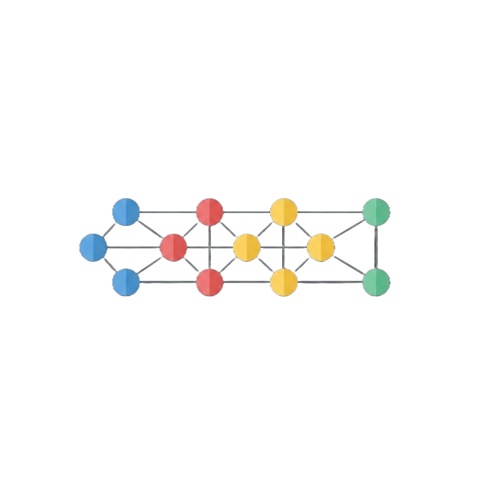
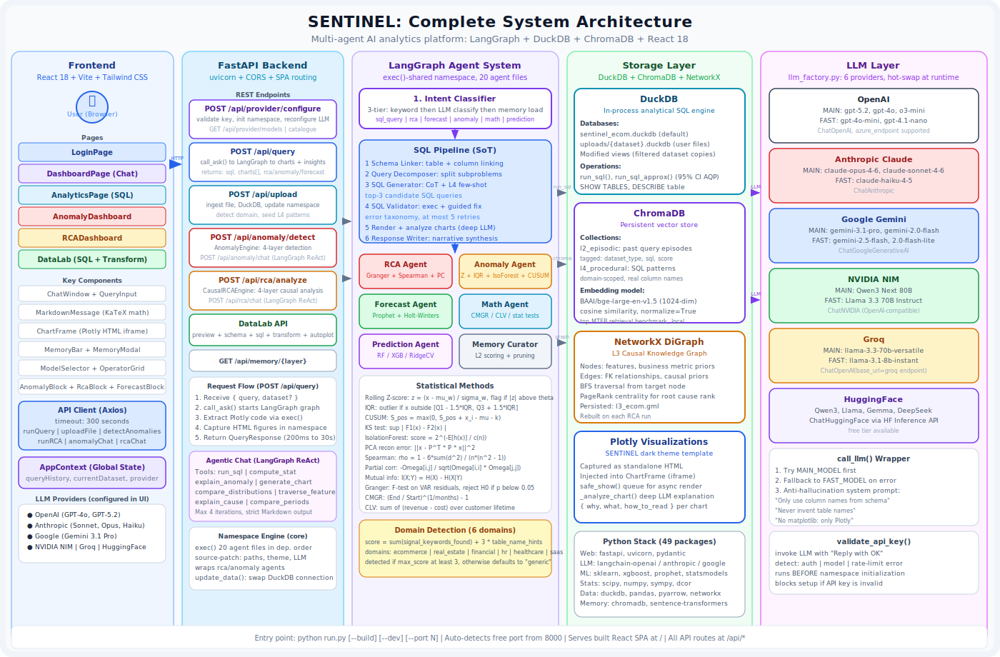
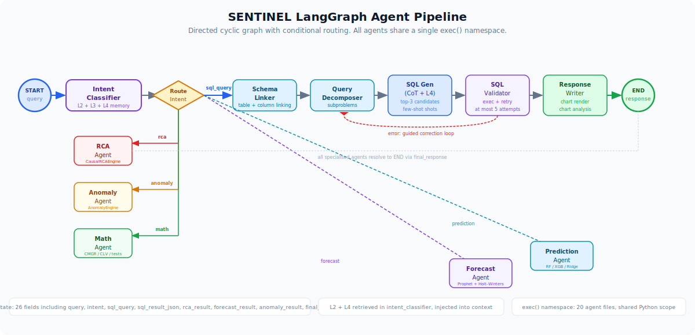
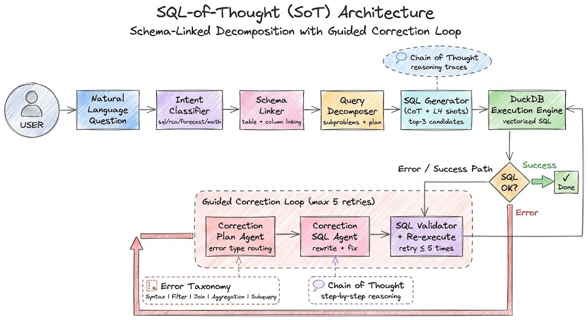
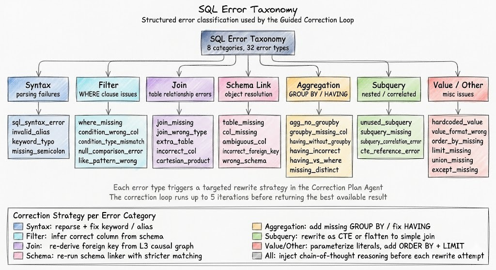
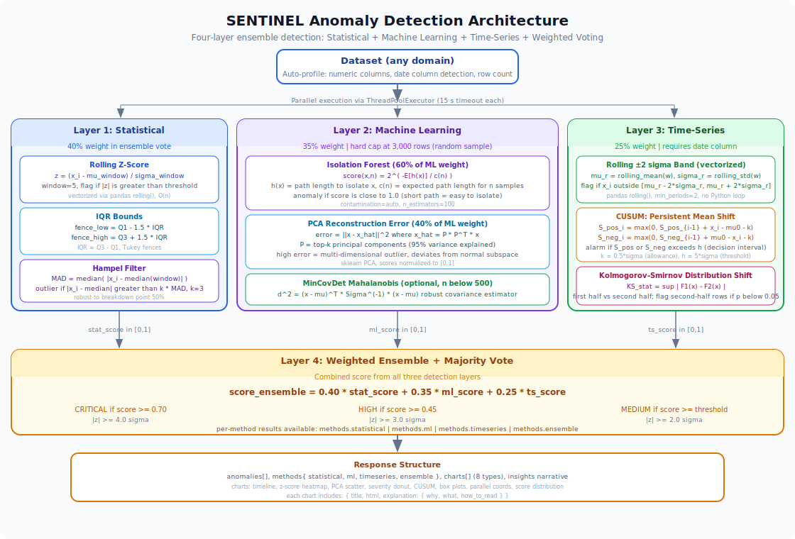
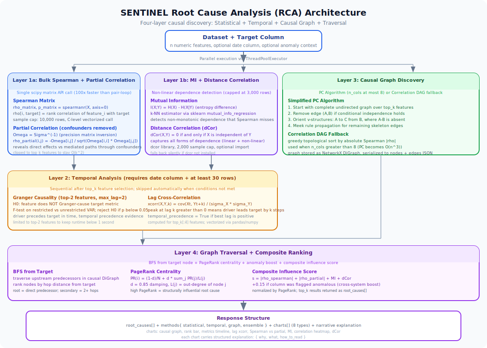

<div align="center">
  
  <h1>SENTINEL</h1>
  <p><strong>Production-grade multi-agent AI analytics platform</strong></p>
  <p>
    LangGraph orchestration · DuckDB · ChromaDB · React 18 · FastAPI
  </p>
  <p>
    
    
    
    
    
  </p>
  <p>
    <a href="#quick-start">Quick Start</a> ·
    <a href="#architecture">Architecture</a> ·
    <a href="#anomaly-detection">Anomaly Detection</a> ·
    <a href="#root-cause-analysis">RCA</a> ·
    <a href="#memory-system">Memory</a> ·
    <a href="#llm-providers">LLM Providers</a>
  </p>
</div>

---

## What is SENTINEL?

SENTINEL is a self-contained analytics platform that lets you upload any structured dataset and ask questions about it in plain English. It combines a six-provider LLM backend, a LangGraph agent pipeline, vectorized anomaly detection, causal root-cause analysis, and a four-tier memory system into a single `python run.py` server with a React frontend.

The system is completely dataset-agnostic. Upload an e-commerce CSV and it detects sales patterns. Upload real estate listings and it computes price-per-sqft regressions. Upload HR data and it runs attrition analysis. The same agents adapt to every domain by discovering schema at runtime instead of hardcoding table names.

### Supported LLM Providers

<table>
  <tr>
    <td align="center"><br/><b>OpenAI</b></td>
    <td align="center"><br/><b>Anthropic</b></td>
    <td align="center"><br/><b>Google</b></td>
    <td align="center"><br/><b>NVIDIA NIM</b></td>
    <td align="center"><br/><b>Groq</b></td>
    <td align="center"><br/><b>HuggingFace</b></td>
  </tr>
</table>

---

## Quick Start

### Prerequisites

- Python 3.10+
- Node.js 18+ (for frontend build)

### Installation

```bash
# Enter the project directory
cd SENTINEL

# Install Python dependencies
pip install -r requirements.txt

# Build frontend (one-time)
python run.py --build

# Start the server
python run.py
# Opens at http://localhost:8000 (auto-detects free port)
```

### Other startup options

```bash
python run.py --dev       # hot-reload for development
python run.py --port 9000 # force a specific port
python run.py --build     # rebuild frontend before starting
```

### First use

1. Open `http://localhost:8000`
2. Choose an LLM provider and paste your API key
3. Upload any CSV, Excel, Parquet, or SQLite file
4. Ask questions in the chat panel

---

## Architecture

### Full System Overview



SENTINEL has five vertical layers:

| Layer | Technology | Responsibility |
|---|---|---|
| Frontend | React 18, Vite, Tailwind | Chat, charts, anomaly/RCA dashboards, DataLab |
| API | FastAPI, uvicorn | REST endpoints, request routing, chart capture |
| Agent System | LangGraph, exec()-namespace | Intent classification, SQL generation, analysis |
| Storage | DuckDB, ChromaDB, NetworkX | Query execution, vector memory, causal graph |
| LLM | LangChain multi-provider | SQL generation, narrative, chart analysis |

### LangGraph Agent Pipeline



Every query flows through a directed LangGraph graph. The `SentinelState` TypedDict (26 fields) carries all context between nodes. The two key conditional edges are the intent route (which specialized agent to call) and the SQL retry loop (re-enter the validator until the query executes or the retry limit is reached).

```
START
  -> intent_classifier       [loads L2+L4+L3 memory, classifies intent]
  -> route_intent            [dispatch to sql or specialized agent]

SQL path:
  -> schema_linker -> query_decomposer -> sql_generator -> sql_validator -> response_writer

Specialized paths:
  -> rca_agent               [Granger + Spearman + PC algorithm]
  -> anomaly_agent           [Z-score + IQR + IsolationForest + CUSUM]
  -> forecast_agent          [Prophet + Holt-Winters]
  -> math_agent              [CMGR + CLV + statistical tests]
  -> prediction_agent        [RidgeCV + RandomForest + XGBoost]

END
```

### Namespace Engine

All 20 agent files are compiled and executed into a single shared Python dictionary (`self._ns`) using `exec(compile(source, path, "exec"), self._ns)`. This replicates the Jupyter notebook environment the agents were originally written for.

Before each `exec()` call the source is patched at the string level:

- Kaggle dataset paths replaced with local DuckDB paths
- Jupyter magics (`!uv pip install`) commented out
- `matplotlib` set to `Agg` backend (headless)
- `plotly_white` replaced with `sentinel` (custom dark template)
- Kaggle secrets blocks replaced with direct API key injection

The load order encodes dependency relationships:

```
model.py -> state.py -> dataset.py -> charts.py -> memory.py ->
chart_analysis.py -> intent_classifir.py -> schema_linker.py ->
query_decomposer.py -> extract_first_sql.py -> sql_validator.py ->
render_chart.py -> sql_response_writer.py -> rca_agent.py ->
forcast_agent.py -> anomaly_agent.py -> math_agent.py ->
prediction_agent.py -> memory_curator.py -> route_intent.py
```

After all files load, `namespace.py` wraps `rca_agent()` and `anomaly_agent()` with dataset-agnostic versions that call the full `CausalRCAEngine` and `AnomalyEngine` from the API layer.

---

## SQL-of-Thought (SoT)

SENTINEL implements the SQL-of-Thought paradigm: chain-of-thought reasoning generates SQL rather than directly predicting it.

### SoT Pipeline



Each query goes through five stages before a result is returned.

**Stage 1: Schema Linking**
The schema linker maps entities in the query to actual table and column names using the LLM plus the current schema context. It calls `SHOW TABLES` and `DESCRIBE` at runtime and never falls back to hardcoded names.

**Stage 2: Query Decomposition**
Complex queries are broken into atomic subproblems. "Which categories have the highest return rate and how does it correlate with rating?" becomes two subproblems with a final synthesis step.

**Stage 3: SQL Generation with Chain of Thought**
`extract_first_sql.py` prompts the LLM with L4 few-shot examples (domain-specific SQL patterns with real column names) and requests three candidate SQL queries, each with explicit reasoning. The chain-of-thought trace is part of the prompt context.

**Stage 4: Guided Correction Loop**
`sql_validator.py` attempts to execute each candidate against DuckDB. On failure it reads the error, classifies it using the error taxonomy, and prompts the LLM for a targeted correction. This loop runs up to five times.

**Stage 5: Chart and Response**
`render_chart.py` detects if the result is chart-worthy and generates Plotly code. `sql_response_writer.py` produces the final narrative.

### SQL Error Taxonomy



The taxonomy organises every possible SQL error into eight categories. Each category triggers a different correction strategy in the Correction Plan Agent.

| Category | Error Types | Correction Strategy |
|---|---|---|
| Syntax | sql_syntax_error, invalid_alias, keyword_typo | reparse, fix keyword or alias |
| Filter | where_missing, condition_wrong_col, condition_type_mismatch | infer correct column from schema |
| Join | join_missing, join_wrong_type, extra_table, incorrect_col | re-derive FK from L3 causal graph |
| Schema Link | table_missing, col_missing, ambiguous_col, incorrect_foreign_key | re-run schema linker with stricter matching |
| Aggregation | agg_no_groupby, groupby_missing_col, having_without_groupby | add missing GROUP BY, fix HAVING |
| Subquery | unused_subquery, subquery_missing, subquery_correlation_error | rewrite as CTE or flatten to join |
| Value | hardcoded_value, value_format_wrong | parameterize literals |
| Other | order_by_missing, limit_missing, union_missing | add missing clauses |

---

## Anomaly Detection



The anomaly detection system runs three independent detection layers in parallel via `ThreadPoolExecutor` and combines their outputs through a weighted ensemble. It works on any numeric dataset with or without a date column.

### Layer 1: Statistical Methods (40% ensemble weight)

**Rolling Z-Score**

For each numeric column and sliding window of size $W = 5$:

$$z_i = \frac{x_i - \mu_{i-W:i}}{\sigma_{i-W:i} + \varepsilon}$$

An observation is flagged as anomalous when $|z_i| > \theta$ where $\theta$ is the user-selected threshold (default 2.0). Severity is assigned as:

$$\text{severity}(z) = \begin{cases} \text{CRITICAL} & |z| \geq 4.0 \\ \text{HIGH} & 3.0 \leq |z| < 4.0 \\ \text{MEDIUM} & 2.0 \leq |z| < 3.0 \end{cases}$$

**IQR Bounds**

The Tukey fences define the normal region for each window:

$$L = Q_1 - 1.5 \cdot \text{IQR}, \quad H = Q_3 + 1.5 \cdot \text{IQR}$$

where $\text{IQR} = Q_3 - Q_1$. Any observation outside $[L, H]$ is flagged.

**Hampel Filter**

The Median Absolute Deviation (MAD) is computed over a rolling window:

$$\text{MAD} = \text{median}\left(|x_i - \tilde{x}_W|\right)$$

An outlier is declared when $|x_i - \tilde{x}_W| > k \cdot \text{MAD}$ with $k = 3$ (approximately $3\sigma$ for Gaussian data).

### Layer 2: Machine Learning (35% ensemble weight, capped at 3,000 rows)

**Isolation Forest (60% of ML score)**

The anomaly score is derived from the expected path length $h(x)$ when isolating a point through random axis-aligned splits:

$$s(x, n) = 2^{-\frac{E[h(x)]}{c(n)}}$$

where $c(n) = 2H(n-1) - \frac{2(n-1)}{n}$ and $H$ is the harmonic number. Values close to 1.0 indicate anomalies; values close to 0.5 indicate normal observations.

**PCA Reconstruction Error (40% of ML score)**

Let $P \in \mathbb{R}^{d \times k}$ be the top-$k$ principal component matrix. The reconstruction error for a standardised observation $\tilde{x}$ is:

$$\text{error} = \|\tilde{x} - P P^\top \tilde{x}\|^2$$

High reconstruction error indicates that the observation does not lie near the principal subspace of normal data. This catches multi-dimensional anomalies that are not outliers in any single feature.

**MinCovDet Mahalanobis Distance (optional, when $n < 500$)**

The Minimum Covariance Determinant estimator produces a robust centre $\hat{\mu}$ and scatter matrix $\hat{\Sigma}$. The Mahalanobis distance is:

$$d^2(x) = (x - \hat{\mu})^\top \hat{\Sigma}^{-1} (x - \hat{\mu})$$

Points with $d^2$ exceeding the $\chi^2_{k, 0.975}$ critical value are flagged.

### Layer 3: Time-Series Methods (25% ensemble weight)

**CUSUM: Cumulative Sum Control Chart**

CUSUM detects persistent mean shifts that rolling Z-scores miss because shifts accumulate gradually. The two-sided CUSUM statistics are:

$$S_i^+ = \max(0,\; S_{i-1}^+ + x_i - \mu_0 - k)$$
$$S_i^- = \max(0,\; S_{i-1}^- + \mu_0 - x_i - k)$$

An alarm is raised when either statistic exceeds the decision interval $h$. The parameter $k = \delta/2$ represents half the target shift to detect; $\delta$ is estimated as the standard deviation of the in-control process.

**Kolmogorov-Smirnov Distribution Shift**

The KS statistic measures the maximum absolute difference between the empirical CDFs of the first and second halves of the series:

$$D = \sup_x \left|F_1(x) - F_2(x)\right|$$

If the p-value is below 0.05, the second half of the dataset has a statistically different distribution from the first half, and those rows receive a base anomaly score of 0.3.

**Rolling ±2σ Band (vectorised)**

The fully vectorised rolling band flags observations outside the rolling mean ± 2 standard deviations using pandas `rolling().mean()` and `rolling().std()` with no Python-level loops:

$$\text{flag}_i = \mathbf{1}\left[x_i \notin \left[\mu_r - 2\sigma_r,\; \mu_r + 2\sigma_r\right]\right]$$

### Layer 4: Weighted Ensemble

The final ensemble score is a convex combination of the three layer scores:

$$s_{\text{ensemble}} = 0.40 \cdot s_{\text{stat}} + 0.35 \cdot s_{\text{ml}} + 0.25 \cdot s_{\text{ts}}$$

Severity thresholds applied to $s_{\text{ensemble}}$:

| Severity | Ensemble Threshold | Z-equivalent |
|---|---|---|
| CRITICAL | $\geq 0.70$ | $\|z\| \geq 4.0$ |
| HIGH | $\geq 0.45$ | $\|z\| \geq 3.0$ |
| MEDIUM | $\geq$ user threshold | $\|z\| \geq 2.0$ |

The API response includes per-method results under `methods.statistical`, `methods.ml`, `methods.timeseries`, and `methods.ensemble`, so users can toggle between detection strategies in the dashboard without re-running the analysis.

### Anomaly Charts

Every chart includes a structured explanation: `why` (why this chart type), `what` (what the visual elements mean), and `how_to_read` (what patterns to look for).

| Chart | Why it was chosen |
|---|---|
| Timeline with markers | Temporal context is the most natural frame for anomalies in time-ordered data |
| Z-score heatmap | Reveals which features spike simultaneously, exposing correlated anomalies |
| PCA scatter | Projects all numeric features to 2D, exposing multi-dimensional outliers invisible in 1D |
| Severity donut | High-level summary suitable for executive reporting |
| Score distribution | Calibration check: good detectors produce bimodal distributions |
| CUSUM chart | Visualises cumulative mean shift before it exceeds individual thresholds |
| Box plots | Per-column baseline sanity check |
| Parallel coordinates | Shows the full anomaly signature across all features simultaneously |

---

## Root Cause Analysis



The RCA engine discovers causal structure from data using four independent analytical layers. It accepts any numeric target column and returns a ranked list of root causes with causal evidence from multiple methods.

### Layer 1a: Bulk Spearman and Partial Correlation

**Spearman Rank Correlation Matrix**

The entire correlation matrix is computed in a single C-level call using scipy's matrix API:

```python
rho_matrix, p_matrix = spearmanr(X, axis=0)
```

This is 100x faster than iterating pairs in Python. The Spearman correlation between feature $X_j$ and target $Y$ is:

$$\rho_S(X_j, Y) = 1 - \frac{6 \sum d_i^2}{n(n^2 - 1)}$$

where $d_i = \text{rank}(X_{ij}) - \text{rank}(Y_i)$.

**Partial Correlation**

The precision matrix $\Omega = \Sigma^{-1}$ encodes conditional independencies. The partial correlation between feature $j$ and target $t$ given all other variables is:

$$\rho_{\text{partial}}(j, t) = \frac{-\Omega_{jt}}{\sqrt{\Omega_{jj} \cdot \Omega_{tt}}}$$

This removes mediated effects: if $A \to B \to Y$, Spearman finds $A$ correlated with $Y$, but partial correlation reveals that $A$ has no direct effect once $B$ is controlled.

### Layer 1b: Mutual Information and Distance Correlation

**Mutual Information**

Mutual information captures all forms of statistical dependence including non-monotonic relationships that Spearman misses:

$$I(X_j; Y) = H(X_j) - H(X_j \mid Y) = \sum_{x,y} p(x,y) \log \frac{p(x,y)}{p(x)\,p(y)}$$

SENTINEL uses the k-nearest-neighbour estimator from scikit-learn's `mutual_info_regression`. Computation is capped at 3,000 rows.

**Distance Correlation (dCor)**

Distance correlation detects ALL forms of statistical dependence, including non-monotonic and non-linear relationships. Its defining property is:

$$\text{dCor}(X, Y) = 0 \iff X \perp Y$$

This is a stronger guarantee than Pearson or Spearman, which can be zero even for strongly dependent variables. SENTINEL uses the `dcor` library with a 2,000-row sample cap.

### Layer 2: Temporal Analysis

**Granger Causality**

Granger causality tests whether past values of $X$ improve forecasts of $Y$ beyond what $Y$'s own history provides. The null hypothesis is that $X$ does not Granger-cause $Y$.

The test fits a Vector Autoregression (VAR) at lags $1, 2$ and compares the restricted model (lagged $Y$ only) against the unrestricted model (lagged $Y$ plus lagged $X$) via an F-test:

$$F = \frac{(\text{RSS}_r - \text{RSS}_u) / p}{\text{RSS}_u / (T - 2p - 1)}$$

A driver is declared Granger-causal when $p < 0.05$. Only the top-2 Spearman-ranked features are tested, and only when at least 30 time-ordered rows are available.

**Cross-Correlation at Lag k**

The normalised cross-correlation function identifies how many periods a driver leads the target:

$$\text{xcorr}(X, Y, k) = \frac{\text{cov}(X_t,\; Y_{t+k})}{\sigma_X \sigma_Y}$$

A peak at $k > 0$ provides temporal precedence evidence that $X$ changes before $Y$ responds.

### Layer 3: Causal Graph Discovery

**PC Algorithm (for $p \leq 8$ features)**

The Peter-Clark (PC) algorithm learns causal structure from conditional independence tests:

1. Start with a complete undirected graph on all features
2. For each edge $(A, B)$, test conditional independence given every subset $S$ of remaining nodes up to size 2. Remove the edge if $p > 0.05$ under any conditioning set.
3. Orient v-structures: wherever $A - C - B$ with $A$ and $B$ not adjacent, orient as $A \to C \leftarrow B$
4. Apply Meek orientation rules to propagate further edge orientations

**Correlation DAG (fallback for $p > 8$)**

When the PC algorithm is too expensive, SENTINEL builds a directed graph by topological sorting of features ranked by absolute Spearman correlation with the target, creating a greedy causal skeleton.

### Layer 4: Graph Traversal and Composite Ranking

**BFS from Target**

Breadth-first search traverses the causal graph upstream from the target node. Features at smaller hop distances receive higher base scores.

**PageRank Centrality**

PageRank measures a node's structural importance in the causal network:

$$\text{PR}(i) = \frac{1-d}{N} + d \sum_{j \in \text{in}(i)} \frac{\text{PR}(j)}{L(j)}$$

where $d = 0.85$ is the damping factor and $L(j)$ is the out-degree of node $j$.

**Composite Root Cause Score**

$$s_i = \left|\rho_S(X_i, Y)\right| + \left|\rho_{\text{partial}}(X_i, Y)\right| + I(X_i; Y) + \text{dCor}(X_i, Y) + 0.15 \cdot \mathbf{1}[X_i \text{ is anomalous}]$$

The anomaly boost of $+0.15$ links the RCA and anomaly detection pipelines: features that are statistically unusual receive additional weight as root cause candidates.

---

## Memory System


SENTINEL maintains four tiers of persistent memory that survive server restarts and inform every query.

### L2: Episodic Memory

Every successfully answered query is stored as an episode in ChromaDB:

```python
l2_store(question, sql, result_summary, dataset_type=domain)
```

**Embedding model:** BAAI/bge-large-en-v1.5 (1024-dimensional, top of the MTEB retrieval benchmark). Each question is prefixed:

```
"Represent this sentence for searching relevant passages: {question}"
```

**Domain isolation:** Retrieval is filtered by `_CURRENT_DATASET_TYPE`. E-commerce SQL patterns never surface when the active dataset is real estate data. This prevents the most common form of memory contamination in multi-dataset systems.

Retrieval: query 4x top_k candidates from ChromaDB, filter by matching domain, return top_k most similar episodes.

### L3: Causal Graph

A `NetworkX DiGraph` built from the uploaded schema captures structural knowledge:

- Nodes: tables, columns, computed metrics, business rules
- Edges: foreign key relationships (multiplicity as edge weight)
- Operations: BFS upstream/downstream from any entity, business rule extraction

The graph is rebuilt on every dataset upload and is used by the intent classifier (causal context), the RCA engine (causal priors), and the SQL validator (FK re-derivation during error correction).

### L4: Procedural Memory

Domain-specific SQL patterns are stored as few-shot examples seeded with real column names. After each upload, `seed_for_dataset_type(con)` runs:

1. Detects domain from column name signals
2. Introspects actual column names and maps them to semantic roles
3. Generates SQL patterns referencing `"actual_column_name"` rather than generic placeholders
4. Deletes patterns from different domains before seeding

**Domain detection scoring:**

$$\text{score}(d) = \sum_{\text{signals}} \mathbf{1}[\text{signal} \in \text{cols}] + 3 \cdot \sum_{\text{table\_hints}} \mathbf{1}[\text{hint} \in \text{table\_names}]$$

Domain $d^*$ is selected when $\text{score}(d^*) \geq 3$; otherwise the system falls back to "generic".

**Supported domains and pattern libraries:**

| Domain | Key Signal Columns | Patterns |
|---|---|---|
| ecommerce | order_date, final_amount, customer_id, status, seller_id | 8 (cohort, seller rank, discount, Pareto) |
| real_estate | sqft, bedrooms, sale_price, neighborhood, year_built | 8 (price/sqft, era comparison, Simpson check) |
| financial | ticker, close, volume, trade_date, returns | 4 (returns, volatility, volume spikes) |
| hr | department, salary, hire_date, job_title, seniority | 4 (salary distribution, hiring trend) |
| generic | any date + numeric | 3 structural patterns |

---

## Forecast Agent

The forecast agent auto-discovers the date column and target metric, then fits a Prophet model with adaptive seasonality.

### Prophet Setup

Seasonality modes are activated based on the actual date range:

```
yearly_seasonality  = date_range_days >= 180
weekly_seasonality  = date_range_days >= 14
daily_seasonality   = date_range_days >= 7 and n_pts >= 14
n_changepoints      = min(5, max(1, n_pts // 10))
interval_width      = 0.90
```

Prophet decomposes the time series as:

$$y(t) = g(t) + s(t) + h(t) + \varepsilon_t$$

where $g(t)$ is the piecewise linear trend, $s(t)$ captures periodic seasonality via Fourier series, $h(t)$ represents holiday effects, and $\varepsilon_t \sim \mathcal{N}(0, \sigma^2)$.

**Forecast horizon inference from query keywords:**

| Keyword | Horizon |
|---|---|
| week | 7 days |
| month | 30 days |
| quarter | 90 days |
| year | 365 days |
| (none) | 7 days |

### Holt-Winters Fallback

When Prophet fails (insufficient data, all-zero series, etc.) the agent falls back to Exponential Smoothing:

$$\hat{y}_{t+h} = \ell_t + h \cdot b_t$$

The `ExponentialSmoothing` model uses additive trend and additive seasonality with period $p = \min(7, n/2)$.

---

## Prediction Agent

The prediction agent selects a model based on task type and dataset size, trains on the uploaded data with automatic feature engineering, and returns predictions with feature importance.

### Task Type Detection

- Regression: target column cardinality > 10% of rows
- Classification: cardinality no more than 10% and no more than 50 unique values
- Time-series: query contains "forecast", "next month", "future"

### Adaptive Model Selection

Model complexity adapts to dataset size to prevent overfitting:

$$d_{\max} = \max\!\left(3,\; \min\!\left(8,\; \left\lfloor\log_2\!\left(\frac{n}{50}\right)\right\rfloor + 1\right)\right)$$

$$n_{\text{leaf}} = \max\!\left(5,\; \left\lfloor\frac{n}{100}\right\rfloor\right)$$

| Condition | Model | Regularisation |
|---|---|---|
| XGBoost requested or $n > 10{,}000$ | XGBRegressor | subsample=0.8, colsample_bytree=0.8, reg_alpha=0.1 |
| Random Forest or $n > 3{,}000$ | RandomForestRegressor | max_depth=$d_{\max}$, min_samples_leaf=$n_{\text{leaf}}$, max_features="sqrt" |
| Small dataset | RidgeCV | cross-validates $\alpha \in \{0.01, 0.1, 1, 10, 100, 1000\}$ over 5 folds |

Ridge regression minimises the L2-penalised loss:

$$\hat{\beta} = \underset{\beta}{\arg\min}\; \|y - X\beta\|^2 + \lambda\|\beta\|^2$$

The closed-form solution is $\hat{\beta} = (X^\top X + \lambda I)^{-1} X^\top y$.

### Feature Engineering

- Drop columns where unique value count > 50 (prevents overfitting on IDs and free text)
- LabelEncoder for categorical columns with no more than 50 unique values
- StandardScaler normalisation: $\tilde{x} = (x - \mu) / \sigma$

Feature importance uses permutation importance:

$$\text{imp}(j) = \text{score}(M) - \text{score}(M_{\text{permute } j})$$

This avoids the upward bias of impurity-based importance for high-cardinality features.

---

## Math Agent

The math agent performs domain-aware analytical computations, discovering schema at runtime.

### Compound Monthly Growth Rate

$$\text{CMGR} = \left(\frac{\text{Revenue}_{\text{end}}}{\text{Revenue}_{\text{start}}}\right)^{1/n_{\text{months}}} - 1$$

### Customer Lifetime Value

$$\text{CLV} = \frac{\text{ARPU} \times \text{Gross Margin}}{\text{Churn Rate}}$$

For e-commerce datasets, only `status = 'delivered'` rows are included.

### Gini Coefficient and Pareto Analysis

The Gini coefficient measures revenue concentration across sellers:

$$G = 1 - 2\int_0^1 L(p)\, dp = \frac{\sum_i (2i - n - 1)\, x_i}{n \sum_i x_i}$$

where $L(p)$ is the Lorenz curve, the cumulative share of revenue held by the bottom $p$ fraction of sellers.

### Statistical Tests

| Test | Statistic | Use Case |
|---|---|---|
| Two-sample t-test | $t = (\bar{x}_1 - \bar{x}_2) / \sqrt{s_1^2/n_1 + s_2^2/n_2}$ | Compare means between two groups |
| Chi-squared | $\chi^2 = \sum (O_i - E_i)^2 / E_i$ | Test independence of categorical variables |
| One-way ANOVA | $F = \text{MS}_{\text{between}} / \text{MS}_{\text{within}}$ | Compare means across multiple groups |

### Simpson's Paradox Detection

A dedicated branch is triggered by keywords "simpson", "paradox", "contradict", "aggregate". The agent runs stratified group comparisons and checks whether the direction of a trend reverses when the data is broken down by a confounding variable. This is particularly useful for real estate (price per sqft overall vs per property type) and e-commerce (average revenue overall vs per platform).

---

## API Reference

### POST /api/query

Main query endpoint. Routes through the LangGraph pipeline.

**Request:**
```json
{
  "query": "Which categories had the highest return rate last month?",
  "dataset": "orders_2024.duckdb"
}
```

**Response:**
```json
{
  "query": "...",
  "intent": "sql_query",
  "sql": "SELECT ...",
  "sql_result_preview": [...],
  "aqp_ci": {"revenue": {"mean": 42300, "ci_lower": 41800, "ci_upper": 42800}},
  "charts": [{"title": "...", "html": "<div>...plotly...</div>"}],
  "insights": "Electronics had the highest return rate at 18.3%...",
  "chart_explanations": "...",
  "memory_info": {"cache_hit": true, "source": "l2", "context_length": 420},
  "duration_ms": 3240
}
```

The `aqp_ci` field contains approximate query processing confidence intervals computed via stratified sampling:

$$\text{CI}_{95} = \hat{\mu} \pm z_{0.975} \cdot \frac{s}{\sqrt{n_{\text{sample}}}}$$

### POST /api/upload

Upload a dataset file. Accepts CSV, Excel, Parquet, SQLite.

**Response:**
```json
{
  "filename": "sales_2024.duckdb",
  "tables": ["orders"],
  "row_count": 125000,
  "date_min": "2024-01-01",
  "date_max": "2024-12-31",
  "domain": "ecommerce"
}
```

### POST /api/anomaly/detect

```json
{
  "table": "orders",
  "threshold": 2.0,
  "method": "ensemble"
}
```

Response includes `methods.statistical`, `methods.ml`, `methods.timeseries`, `methods.ensemble` each with their own anomaly lists and stats, plus eight charts with `{why, what, how_to_read}` explanations.

### POST /api/rca/analyze

```json
{
  "table": "orders",
  "target_col": "revenue",
  "p_threshold": 0.05,
  "top_k": 8
}
```

Response includes ranked root causes with composite scores, per-method results from four analytical layers, and seven charts with structured explanations.

### POST /api/anomaly/chat and POST /api/rca/chat

Agentic chat endpoints backed by LangGraph ReAct agents. Accept multi-turn conversation history and support up to four tool calls per response.

**Anomaly chat tools:** `run_sql`, `compute_stat`, `explain_anomaly`, `generate_chart`, `compare_distributions`

**RCA chat tools:** `run_sql`, `traverse_feature`, `compare_feature_periods`, `generate_chart`, `explain_cause`

All responses are strict GitHub-flavoured Markdown. Mathematical formulas use inline LaTeX rendered with KaTeX in the frontend.

### DataLab Endpoints

| Endpoint | Purpose |
|---|---|
| `GET /api/datalab/tables` | List all tables in the active database |
| `GET /api/datalab/schema/{table}` | Column types, nullability, sample values |
| `GET /api/datalab/preview/{table}` | Paginated row preview |
| `POST /api/datalab/sql` | Execute arbitrary SQL against DuckDB |
| `POST /api/datalab/transform` | Filter, aggregate, or sample operations |
| `GET /api/datalab/autoplot/{table}` | Auto-generate a chart for a table |

---

## LLM Providers

All providers are configured through the login page. Keys are validated by invoking the model with a test prompt before the namespace is initialised.

| Provider | Main Model | Fast Model | LangChain Class |
|---|---|---|---|
| OpenAI | gpt-5.2, gpt-4o | gpt-4o-mini | ChatOpenAI |
| Anthropic | claude-opus-4-6, claude-sonnet-4-6 | claude-haiku-4-5 | ChatAnthropic |
| Google | gemini-3.1-pro | gemini-2.5-flash | ChatGoogleGenerativeAI |
| NVIDIA NIM | Qwen3 Next 80B | Llama 3.3 70B Instruct | ChatNVIDIA |
| Groq | llama-3.3-70b-versatile | llama-3.1-8b-instant | ChatOpenAI (Groq base URL) |
| HuggingFace | Qwen3, Llama, DeepSeek, Gemma | varies | ChatHuggingFace |

The `call_llm()` wrapper attempts MAIN_MODEL first and falls back to FAST_MODEL on any error. It injects an anti-hallucination system prompt that instructs the model never to reference table or column names that do not appear in the provided schema.

Providers can be hot-swapped through the UI without restarting the server. `reconfigure_llm()` in the namespace engine rebuilds the LLM pair and updates all agent references in the shared namespace.

---

## Frontend

The frontend is a React 18 SPA built with Vite and Tailwind CSS. It is served from `frontend/dist/` as a static site; all `/api/*` requests go to the FastAPI backend.

### Pages

| Page | Route | Purpose |
|---|---|---|
| LoginPage | `/` | API key entry, provider selection, key validation |
| DashboardPage | `/dashboard` | Main chat with query history and memory indicator |
| AnalyticsPage | `/analytics` | SQL builder and result explorer |
| AnomalyDashboard | `/anomaly` | Multi-layer anomaly detection with method toggle |
| RCADashboard | `/rca` | Causal graph visualisation with ranked driver panel |
| DataLab | `/datalab` | Schema browser, data preview, custom SQL |

### Key Components

**MarkdownMessage** renders all assistant responses with full GitHub-flavoured Markdown support including tables, strikethrough, task lists, inline and block LaTeX (KaTeX), and syntax-highlighted code blocks. It replaces plain `whitespace-pre-wrap` divs throughout the chat panels.

**ChartFrame** wraps Plotly HTML figures in sandboxed iframes. The SENTINEL dark template (`paper_bgcolor: #111827`) is injected at the namespace level so all charts match the UI palette.

**MemoryBar** shows L2/L3/L4 memory activity as coloured indicators. Clicking opens MemoryModal, which displays the actual episodes and patterns retrieved for the last query.

**OperatorGrid** shows provider logos on the login page and lets users switch providers mid-session.

---

## Configuration

### Environment variables

```env
DEFAULT_PROVIDER=openai
DEFAULT_MAIN_MODEL=gpt-4o
DEFAULT_FAST_MODEL=gpt-4o-mini
HOST=0.0.0.0
PORT=8000
```

### Data directory layout

```
data/
├── sentinel_ecom.duckdb   # default e-commerce sample dataset
├── chroma_bge/            # ChromaDB persistent storage (L2 + L4)
├── l3_ecom.gml            # NetworkX causal graph (GML format)
└── uploads/               # user-uploaded datasets (one .duckdb per file)
```

---

## Performance

| Operation | Typical Duration | Notes |
|---|---|---|
| SQL query (simple) | 2-8 s | LLM generation + DuckDB execution |
| SQL query (complex with retry) | 8-25 s | Up to 5 correction iterations |
| Anomaly detection (100k rows) | under 5 s | Vectorised layers, 3k ML sample cap |
| RCA analysis | 5-15 s | Parallel Spearman + selective Granger |
| Forecast (Prophet) | 5-10 s | Adaptive seasonality fitting |
| ML prediction (training) | 10-25 s | Feature engineering + cross-validation |
| Memory retrieval (L2/L4) | under 100 ms | ChromaDB vector search |
| Frontend build | ~10 s | Vite production bundle |

Two main bottlenecks eliminated compared to naive implementations:

**Granger causality** now runs on only the top-2 features (previously top-5) with max_lag=2 (previously 3). This reduces wall time from 10-40 s to under 1 s for most datasets.

**LOF (Local Outlier Factor)** was removed from the ML layer. Its $O(n^2)$ complexity made it the primary cause of the anomaly page spinning indefinitely on datasets with more than 5,000 rows.

---

## Project Structure

```
SENTINEL/
├── backend/
│   ├── agents/                     # 20 agent files (exec()'d into shared namespace)
│   │   ├── model.py                # LLM config, call_llm() wrapper
│   │   ├── state.py                # SentinelState TypedDict (26 fields)
│   │   ├── dataset.py              # run_sql(), AQP, L3 causal graph
│   │   ├── charts.py               # safe_show(), chart queue
│   │   ├── memory.py               # L2/L4 ChromaDB, domain detection, seeding
│   │   ├── chart_analysis.py       # _analyze_chart() per-chart LLM explanations
│   │   ├── intent_classifir.py     # 3-tier intent classification
│   │   ├── schema_linker.py        # table+column linking
│   │   ├── query_decomposer.py     # subproblem decomposition
│   │   ├── extract_first_sql.py    # CoT SQL generation with L4 few-shot (SoT)
│   │   ├── sql_validator.py        # guided correction loop, error taxonomy
│   │   ├── render_chart.py         # Plotly code generation + exec()
│   │   ├── sql_response_writer.py  # narrative response formatting
│   │   ├── rca_agent.py            # e-commerce inline RCA (domain guard)
│   │   ├── forcast_agent.py        # Prophet + Holt-Winters forecasting
│   │   ├── anomaly_agent.py        # inline anomaly agent (domain guard)
│   │   ├── math_agent.py           # CMGR, CLV, Gini, tests, Simpson paradox
│   │   ├── prediction_agent.py     # RF, XGB, RidgeCV with adaptive params
│   │   ├── memory_curator.py       # L2 scoring and pruning
│   │   └── route_intent.py         # intent-to-agent dispatch
│   ├── api/
│   │   ├── auth.py                 # provider config + key validation
│   │   ├── query.py                # POST /api/query (main pipeline)
│   │   ├── upload.py               # POST /api/upload (dataset ingestion)
│   │   ├── anomaly.py              # AnomalyEngine, 4-layer detection
│   │   ├── rca.py                  # CausalRCAEngine, 4-layer causal analysis
│   │   ├── anomaly_chat_agent.py   # LangGraph ReAct agent for anomaly chat
│   │   ├── rca_chat_agent.py       # LangGraph ReAct agent for RCA chat
│   │   ├── datalab.py              # data exploration endpoints
│   │   ├── memory.py               # memory stats + inspection endpoints
│   │   └── schemas.py              # Pydantic request/response models
│   ├── core/
│   │   ├── namespace.py            # exec() engine, source patching, agent wrapping
│   │   ├── llm_factory.py          # 6-provider LLM factory + key validation
│   │   └── data_loader.py          # CSV/Excel/Parquet/SQLite ingestion
│   └── main.py                     # FastAPI app, CORS, SPA routing
├── frontend/
│   ├── src/
│   │   ├── pages/                  # 6 page components
│   │   ├── components/
│   │   │   ├── auth/               # ApiKeyInput, ModelSelector, OperatorGrid
│   │   │   ├── chat/               # ChatWindow, MessageBubble, QueryInput
│   │   │   ├── results/            # ChartFrame, AnomalyBlock, RcaBlock, ...
│   │   │   ├── layout/             # Sidebar, TopBar
│   │   │   ├── memory/             # MemoryBar, MemoryModal
│   │   │   └── MarkdownMessage.jsx # react-markdown + KaTeX
│   │   ├── api/client.js           # Axios API client (300s timeout)
│   │   └── AppContext.jsx          # global React state
│   └── package.json
├── images/
│   ├── full_architecture.svg       # complete system overview
│   ├── agent_pipeline.svg          # LangGraph flow
│   ├── sot_architecture.svg        # SQL-of-Thought pipeline
│   ├── sot_error_taxonomy.svg      # SQL error classification tree
│   ├── memory_architecture.svg     # L2/L3/L4 memory tiers
│   ├── anomaly_architecture.svg    # 4-layer anomaly detection
│   ├── rca_architecture.svg        # 4-layer causal analysis
│   ├── SoT.png                     # original SoT reference diagram
│   └── SoT_2.png                   # original error taxonomy reference
├── logos/                          # provider and brand assets
├── data/                           # persistent storage
├── requirements.txt                # 49 Python packages
├── run.py                          # startup script with auto-port binding
└── README.md
```

---

## Dependencies

### Python (49 packages)

```
fastapi>=0.111.0          uvicorn[standard]>=0.29.0   pydantic>=2.0.0
langchain-core>=0.2.0     langchain-openai>=0.1.0     langchain-anthropic>=0.1.4
langchain-google-genai    langchain-nvidia-ai-endpoints langgraph>=0.1.0
duckdb>=1.0.0             chromadb>=0.5.0             sentence-transformers>=2.7.0
FlagEmbedding>=1.2.0      scikit-learn>=1.4.0         statsmodels>=0.14.0
scipy>=1.13.0             numpy>=1.26.0               pandas>=2.2.0
prophet>=1.1.5            xgboost>=2.0.0              sympy>=1.12
networkx>=3.3             plotly>=5.22.0              kaleido>=0.2.1
matplotlib>=3.8.0         openpyxl>=3.1.0             pyarrow>=15.0.0
python-dotenv>=1.0.0      httpx>=0.27.0               groq>=0.9.0
```

### Node.js

```
react@^18.3.1             react-router-dom@^6.26.0    axios@^1.7.2
react-markdown@^10.1.0    remark-gfm                  remark-math
rehype-katex@^7.0.1       katex@^0.16.11              lucide-react@^0.400.0
vite@^5.3.4               tailwindcss@^3.4.6          postcss autoprefixer
```

---

## Design Decisions

**Why `exec()` instead of imports?**
The agents were originally Jupyter notebook cells sharing a global namespace. Converting them to importable modules would require threading all shared symbols through function arguments or a dependency injection container. The `exec()` approach preserves the original semantics while adding source-level patching for environment differences.

**Why DuckDB instead of a server database?**
DuckDB runs in-process with zero configuration. For single-user analytical workloads it is faster than PostgreSQL for aggregation queries (vectorised execution, column-oriented storage). Each uploaded dataset gets its own `.duckdb` file, eliminating cross-dataset table name collisions.

**Why BGE-Large instead of OpenAI embeddings for memory?**
BGE-Large-en-v1.5 ranks at the top of the MTEB retrieval benchmark and runs locally without API calls. L2 memory retrieval must work even when the LLM provider is unavailable or rate-limited.

**Why domain-filtered memory?**
Without domain filtering, an episode where `SELECT SUM(final_amount) FROM orders` answered a revenue question would surface as a few-shot example for a real estate price query. The resulting SQL would reference a non-existent `orders` table. Domain tagging on L2 and L4 eliminates this class of contamination entirely.

**Why cap the ML layer at 3,000 rows?**
After removing LOF, IsolationForest and PCA scale well beyond 3,000 rows. The cap still gives statistically stable results: Cochran's sample size formula gives $n \approx 384$ at 95% confidence for proportions, so 3,000 rows is nearly 8x the theoretical minimum. The main benefit is bounding worst-case latency.
